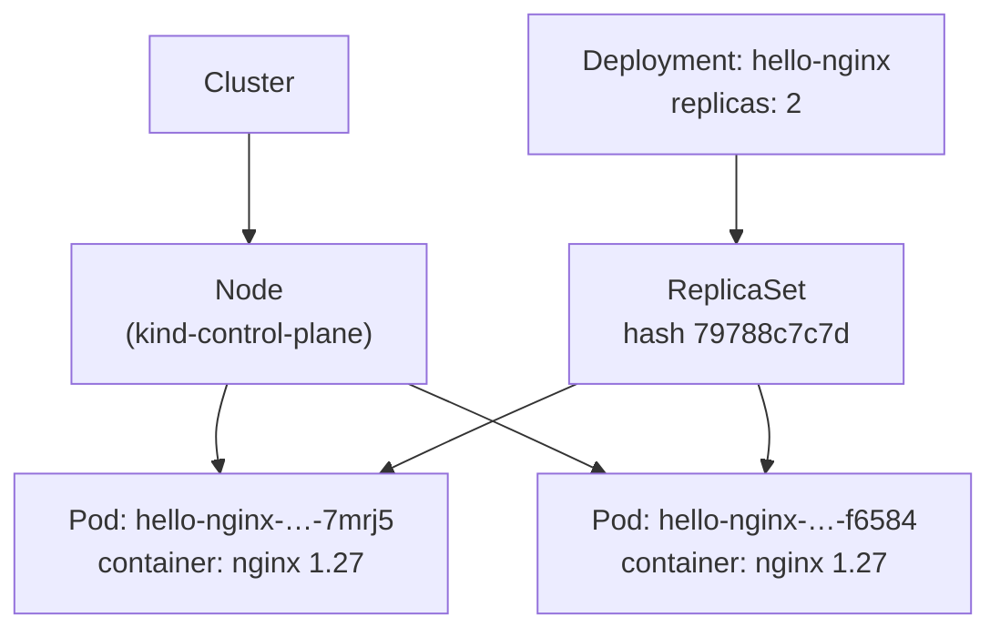
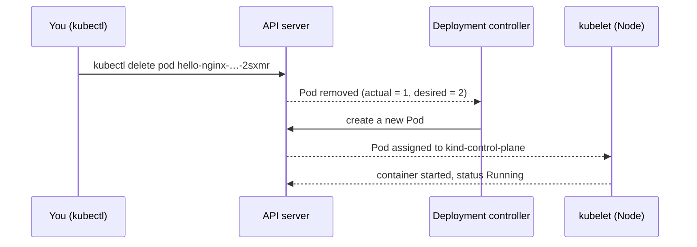

# 01: First Deployment

> **Status:** completed · **Cluster:** kind v1.37.0 (single control-plane node) · **Tooling:** kubectl, Docker Desktop

## Objective

Run two replicas of an nginx web server with a **Deployment**, then verify that Kubernetes restores the desired state automatically when a Pod is deleted.

By the end of this exercise you should be able to explain:

1. How a Deployment, a ReplicaSet, and Pods relate to each other.
2. Why the `selector` and the Pod template labels must match.
3. What "desired state" means and how Kubernetes enforces it.

## Concepts

### Object hierarchy



- A **Deployment** declares the desired state.
- A **ReplicaSet** (created automatically) enforces the replica count.
- **Pods** run on **Nodes**. A Node is the machine; the Pod runs inside it.

### Self-healing loop



The controller compares **desired** (2) with **actual** (1) and closes the gap. This loop never stops running.

## Files

| File | Purpose |
|---|---|
| [`deployment.yaml`](deployment.yaml) | Deployment with 2 replicas of `nginx:1.27` on port 80 |

## Reading the manifest

```yaml
apiVersion: apps/v1          # API group and version that defines Deployment
kind: Deployment             # object type
metadata:
  name: hello-nginx          # unique name in the namespace
spec:                        # desired state
  replicas: 2                # keep exactly 2 Pods running
  selector:
    matchLabels:
      app: hello-nginx       # how the Deployment finds the Pods it owns
  template:                  # blueprint for every Pod
    metadata:
      labels:
        app: hello-nginx     # label stamped on each Pod (must match selector)
    spec:
      containers:            # list of containers in each Pod
        - name: nginx
          image: nginx:1.27  # pinned tag; avoid "latest"
          ports:
            - containerPort: 80   # informational; does not publish the port
```

**Syntax rules used here**

- Indentation uses spaces (2 per level). Tabs are invalid.
- `key: value` is a mapping. A leading `-` marks a list item.
- `#` starts a comment.
- Each key may appear only once per mapping. A duplicate key is an error.

## Steps

```bash
# 1. Start the cluster (Docker Desktop must be running)
kind create cluster

# 2. Confirm the node is Ready
kubectl get nodes

# 3. Change into the exercise folder, then apply the manifest
cd /Users/kuroko/Desktop/Nikan/k8s-practice/01-first-deployment
kubectl apply -f deployment.yaml

# 4. List the Pods
kubectl get pods

# 5. Delete one Pod and observe the replacement
kubectl delete pod <pod-name>
kubectl get pods
```

## Results

**Step 2: node**

```
NAME                 STATUS   ROLES           AGE     VERSION
kind-control-plane   Ready    control-plane   3m44s   v1.37.0
```

**Step 4: initial Pods**

```
NAME                           READY   STATUS    RESTARTS   AGE
hello-nginx-79788c7c7d-2sxmr   1/1     Running   0          40s
hello-nginx-79788c7c7d-7mrj5   1/1     Running   0          40s
```

**Step 5: after deleting `2sxmr`**

```
NAME                           READY   STATUS    RESTARTS   AGE
hello-nginx-79788c7c7d-7mrj5   1/1     Running   0          2m12s
hello-nginx-79788c7c7d-f6584   1/1     Running   0          0s
```

The deleted Pod is gone. A new Pod (`f6584`) was created within a second, and the count is back to 2.

## Observations

1. **Name anatomy.** `hello-nginx-79788c7c7d-7mrj5` is three parts: the Deployment name, the ReplicaSet hash (`79788c7c7d`, which changes when the Pod template changes), and a unique Pod suffix.
2. **Self-healing works.** Deleting a Pod does not reduce the replica count. The controller recreates it immediately.
3. **`READY 1/1`** means the one container in the Pod passed its readiness check. `RESTARTS 0` means it has not crashed.
4. **`ContainerCreating` is normal on first run.** The image has to be pulled before the container starts.
5. **Two Deployments can share a cluster** as long as their selector labels differ (see below).

## Common mistakes

| Mistake | What happens | Fix |
|---|---|---|
| Running `kubectl apply` from the wrong folder | `the path "deployment.yaml" does not exist` | `cd` into `01-first-deployment` first |
| Duplicate `name:` under `metadata` | YAML error, or the wrong name is used | Keep one `name` per object |
| Two Deployments with the same `app` label | They compete for each other's Pods | Give each Deployment its own label |
| `selector` does not match template labels | Deployment is rejected | Make the two values identical |

## Extra: a second Deployment

A second Deployment (`nikan`) was created from its own file with a separate label:

```yaml
selector:
  matchLabels:
    app: nikan
```

Result: four Pods, two from each Deployment, running side by side without interfering with each other.

## Interview phrasing

> "A Deployment declares how many replicas I want. Its ReplicaSet makes sure that many Pods are running, and if one fails, it's replaced automatically."

## Clean up

```bash
kubectl delete -f deployment.yaml
kubectl delete -f deployment-nikan.yaml
kind delete cluster
```

## Next

**Exercise 02: Service.** The Pods above have no stable address and cannot be reached from outside the cluster. A Service gives them one address and load-balances traffic across the replicas.
