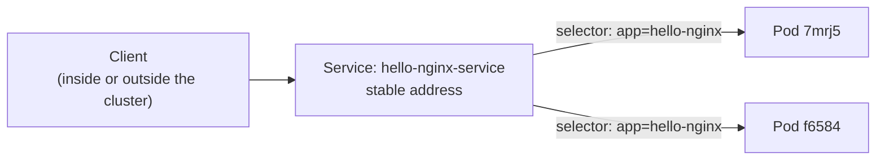

# 02: Service

> **Status:** completed · **Builds on:** [01-first-deployment](../01-first-deployment/)

## Objective

Give the `hello-nginx` Pods from Exercise 01 a stable address, and reach one of them from outside the cluster, even though the individual Pods can be deleted and replaced at any time.

By the end of this exercise you should be able to explain:

1. Why Pods alone are not reachable in a reliable way.
2. How a Service finds its Pods (the same label/selector mechanism as a Deployment).
3. The difference between `port`, `targetPort`, and `nodePort`.
4. What `ClusterIP`, `NodePort`, and `LoadBalancer` each give you.

## Concepts

### The problem a Service solves

Every time a Pod is replaced, it gets a new name and a new internal IP. Nothing that depends on a fixed address can point directly at a Pod.



The Service watches for Pods matching its selector and spreads traffic across whichever ones currently exist. Pods come and go; the Service's address does not change.

### Service types

| Type | Reachable from | Typical use |
|---|---|---|
| `ClusterIP` (default) | Inside the cluster only | Service-to-service traffic (e.g. a backend calling a database) |
| `NodePort` | Outside the cluster, via `<node-ip>:<nodePort>` | Local testing, simple demos |
| `LoadBalancer` | Outside the cluster, via a cloud provider's load balancer | Public-facing services in production (AWS/Azure/GCP provision a real LB) |

This exercise uses `NodePort` because it is the simplest type to test from a laptop.

## Reading the manifest

```yaml
apiVersion: v1                 # Service is part of the core API group ("v1"), unlike Deployment
kind: Service
metadata:
  name: hello-nginx-service
spec:
  type: NodePort                # exposes the Service on a port on every Node
  selector:
    app: hello-nginx            # same mechanism as a Deployment: match Pods by label
  ports:
    - port: 80                  # the Service's own port, used inside the cluster
      targetPort: 80            # forwarded to this port on the matched Pods (== containerPort)
      nodePort: 30080            # port opened on the Node, reachable from your machine
```

**`port` vs `targetPort` vs `nodePort`, in one line each**

- `port`: what other things inside the cluster dial.
- `targetPort`: what the Service forwards to on the Pod (must match the container's listening port).
- `nodePort`: what you dial from outside the cluster (kind maps this to your laptop with `extraPortMappings`, or you reach it via `kubectl port-forward` — see Steps).

## Files

| File | Purpose |
|---|---|
| [`service.yaml`](service.yaml) | NodePort Service routing to the `hello-nginx` Pods on port 80 |

## Steps

Exercise 01's Deployment must already be applied (its Pods need to exist for the Service to have anything to select).

```bash
# 1. Make sure the hello-nginx Pods exist
kubectl get pods -l app=hello-nginx

# 2. Apply the Service
cd /Users/kuroko/Desktop/Nikan/k8s-practice/02-service
kubectl apply -f service.yaml

# 3. Confirm the Service was created and see its ClusterIP + NodePort
kubectl get service hello-nginx-service

# 4. See which Pods the Service currently targets
kubectl get endpoints hello-nginx-service

# 5. Reach it. A plain "kind" cluster does not expose nodePort to your laptop by
#    default, so the simplest way in is port-forward:
kubectl port-forward service/hello-nginx-service 8080:80
# then, in a second terminal:
curl http://localhost:8080
```

## Expected result

- Step 3: a Service with `TYPE NodePort`, a `CLUSTER-IP`, and `PORT(S)` showing `80:30080/TCP`.
- Step 4: two endpoints (Pod IPs), matching the two `hello-nginx` Pods.
- Step 5: `curl` returns the nginx welcome page HTML (`<title>Welcome to nginx!</title>`).

## Results

**Step 3: the Service**

```
NAME                  TYPE       CLUSTER-IP     EXTERNAL-IP   PORT(S)        AGE
hello-nginx-service   NodePort   10.96.170.36   <none>        80:30080/TCP   74s
```

**Step 4: endpoints**

```
NAME                  ENDPOINTS                     AGE
hello-nginx-service   10.244.0.5:80,10.244.0.7:80   84s
```

**Step 5: reaching it from outside the cluster**

```bash
kubectl port-forward service/hello-nginx-service 8080:80
```

```bash
curl http://localhost:8080
```

```html
<!DOCTYPE html>
<html>
<head>
<title>Welcome to nginx!</title>
...
<h1>Welcome to nginx!</h1>
<p>If you see this page, the nginx web server is successfully installed and
working. Further configuration is required.</p>
...
</html>
```

## Observations

1. **The Service got its own stable `CLUSTER-IP`** (`10.96.170.36`), separate from any Pod's IP. This address does not change even if the Pods behind it do.
2. **`PORT(S)` showed `80:30080/TCP`**, matching `port: 80` (internal) and `nodePort: 30080` (external) from the manifest.
3. **Endpoints matched exactly the two `hello-nginx` Pods**, not the `nikan` Pods from the same cluster. The selector (`app: hello-nginx`) filtered correctly, proving selectors work the same way for a Service as for a Deployment.
4. **`kubectl port-forward` was the practical way in**, since a plain `kind` cluster does not expose `nodePort` to the host machine by default. On a managed cluster (EKS/AKS/GKE) or with a `LoadBalancer` type, this step would not be needed.
5. **`curl` got the real nginx response**, confirming traffic flowed: client → Service → one of the two Pods → nginx → back to the client.

## Clean up

```bash
kubectl delete -f service.yaml
```

## Interview phrasing

> "A Service gives a set of Pods one stable address. It finds its Pods with a label selector, the same mechanism a Deployment uses, and load-balances traffic across whichever Pods currently match — even as Pods are replaced underneath it."

## Next

**Exercise 03: scaling and a rolling update.** Change `replicas` and the image tag on a live Deployment, and watch Kubernetes roll out the change without downtime.
