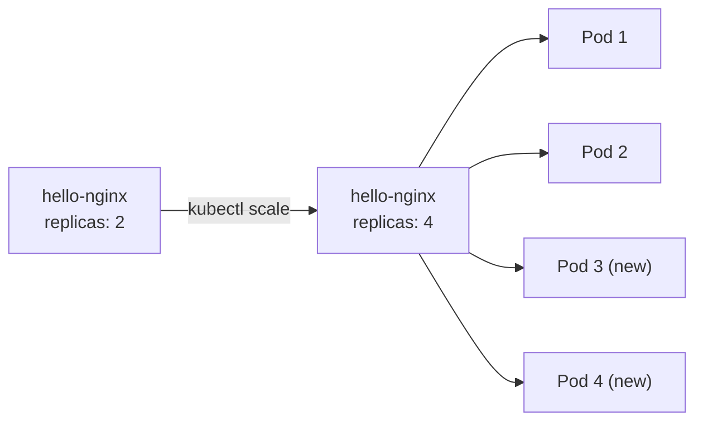
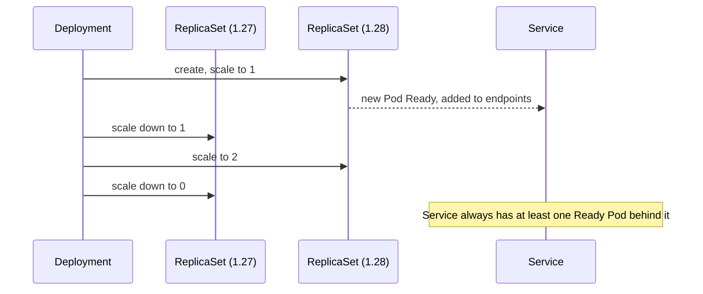

# 03: Scaling and Rolling Updates

> **Status:** completed · **Builds on:** [01-first-deployment](../01-first-deployment/), [02-service](../02-service/)

## Objective

Change the number of replicas on a live Deployment, then roll out a new image version, with zero downtime for clients hitting the Service.

By the end of this exercise you should be able to explain:

1. How `kubectl scale` changes replica count without touching the manifest file.
2. What a rolling update is and why it avoids downtime.
3. How to check rollout status and history, and how to roll back.

## Concepts

### Scaling

`replicas` in a Deployment is not fixed forever. You can change it live:



The ReplicaSet notices the gap between desired (4) and actual (2), and creates 2 more Pods. No existing Pod is touched.

### Rolling update

Changing the image tag (e.g. `nginx:1.27` → `nginx:1.28`) does **not** restart all Pods at once. Kubernetes creates a **new ReplicaSet** for the new version and scales it up gradually while scaling the old one down, a few Pods at a time.



The Service's endpoints update automatically as Pods become Ready or are removed. Clients never hit a moment with zero Pods available.

## Commands used

```bash
# Scale an existing Deployment up
kubectl scale deployment hello-nginx --replicas=4

# Watch Pods appear
kubectl get pods -l app=hello-nginx

# Trigger a rolling update by changing the image
kubectl set image deployment/hello-nginx nginx=nginx:1.28

# Watch the rollout happen
kubectl rollout status deployment/hello-nginx

# See the rollout history
kubectl rollout history deployment/hello-nginx

# Roll back to the previous version if something is wrong
kubectl rollout undo deployment/hello-nginx
```

## Steps

```bash
# 1. Confirm the current state (from Exercise 01)
kubectl get deployment hello-nginx
kubectl get pods -l app=hello-nginx

# 2. Scale to 4 replicas
kubectl scale deployment hello-nginx --replicas=4
kubectl get pods -l app=hello-nginx

# 3. While scaled, confirm the Service still routes correctly
kubectl get endpoints hello-nginx-service

# 4. Trigger a rolling update
kubectl set image deployment/hello-nginx nginx=nginx:1.28
kubectl rollout status deployment/hello-nginx

# 5. Check what changed
kubectl get pods -l app=hello-nginx
kubectl describe deployment hello-nginx | grep Image

# 6. Check rollout history
kubectl rollout history deployment/hello-nginx

# 7. Roll back, to practice recovering from a bad release
kubectl rollout undo deployment/hello-nginx
kubectl get pods -l app=hello-nginx
```

## Expected result

- Step 2: 4 Pods total, all eventually `Running`.
- Step 4: `kubectl rollout status` reports a successful rollout (no errors, ends with "successfully rolled out").
- Step 5: `describe` shows `nginx:1.28`, not `1.27`.
- Step 7: the Deployment goes back to `nginx:1.27`, proving a bad rollout can be undone quickly.

## Results

**Step 2: scaling to 4**

```
deployment.apps/hello-nginx scaled
NAME                           READY   STATUS    RESTARTS   AGE
hello-nginx-79788c7c7d-42nbq   0/1     Pending   0          0s
hello-nginx-79788c7c7d-7mrj5   1/1     Running   0          10h
hello-nginx-79788c7c7d-cb4h8   0/1     Pending   0          0s
hello-nginx-79788c7c7d-f6584   1/1     Running   0          10h
```

A few seconds later, all 4 were `Running`.

**Step 3: Service endpoints after scaling**

```
hello-nginx-service   10.244.0.10:80,10.244.0.11:80,10.244.0.5:80 + 1 more...   13m
```

Four endpoints, matching the 4 Pods.

**Step 4: rolling update to nginx:1.28**

```
deployment.apps/hello-nginx image updated
Waiting for deployment "hello-nginx" rollout to finish: 2 out of 4 new replicas have been updated...
Waiting for deployment "hello-nginx" rollout to finish: 3 out of 4 new replicas have been updated...
Waiting for deployment "hello-nginx" rollout to finish: 1 old replicas are pending termination...
Waiting for deployment "hello-nginx" rollout to finish: 3 of 4 updated replicas are available...
deployment "hello-nginx" successfully rolled out
```

**Step 5: confirming the new image**

```
kubectl describe deployment hello-nginx | grep Image
    Image:         nginx:1.28
```

**Step 6: rollout history**

```
REVISION  CHANGE-CAUSE
1         <none>
2         <none>
```

**Step 7: rollback**

```
deployment.apps/hello-nginx rolled back
NAME                           READY   STATUS    RESTARTS   AGE
hello-nginx-79788c7c7d-2j2j5   1/1     Running   0          7s
hello-nginx-79788c7c7d-76dsr   1/1     Running   0          7s
hello-nginx-79788c7c7d-l5rmf   1/1     Running   0          7s
hello-nginx-79788c7c7d-wg6w4   1/1     Running   0          7s
```

## Observations

1. **Scaling up is not instant.** New Pods start `Pending` (not yet scheduled / image not yet confirmed locally) before turning `Running` within seconds.
2. **The Service picked up the new Pods automatically.** No change to `service.yaml` was needed; the endpoint count went from 2 to 4 because the selector still matched.
3. **The rollout never dropped to zero available Pods.** The status messages moved from "2 out of 4 updated" to "3 of 4 updated replicas are available" without ever showing 0 available — this is the no-downtime guarantee in practice, not just in theory.
4. **`CHANGE-CAUSE` was empty in the history.** Kubernetes tracks that a change happened, but not *why*, unless you record it (e.g. `kubectl annotate deployment hello-nginx kubernetes.io/change-cause="..."`). Worth doing in a real rollout for anyone debugging later.
5. **Rollback reused the original ReplicaSet.** After `rollout undo`, the new Pod names still carried the hash `79788c7c7d` — the same hash as the original `nginx:1.27` Pods, not a newly generated one. Kubernetes keeps old ReplicaSets around (scaled to 0) specifically so a rollback is instant instead of rebuilding from scratch.

## Interview phrasing

> "A rolling update replaces Pods gradually, by creating a new ReplicaSet and scaling it up while scaling the old one down, so the Service always has Ready Pods behind it. If something's wrong with the new version, `kubectl rollout undo` reverts to the previous ReplicaSet."

## Next

**Exercise 04: health checks (liveness and readiness probes).** Make Kubernetes detect a broken Pod on its own, instead of assuming "container started" means "container works."
