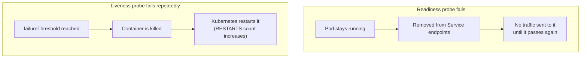

# 04: Health Checks (Readiness and Liveness Probes)

> **Status:** completed · **Builds on:** [01-first-deployment](../01-first-deployment/)

## Objective

Teach Kubernetes to tell the difference between "the container started" and "the container actually works," using readiness and liveness probes. Then break a probe on purpose and watch Kubernetes react.

By the end of this exercise you should be able to explain:

1. The difference between a readiness probe and a liveness probe.
2. What happens to a Pod when each type fails.
3. Why "container is running" is not the same guarantee as "container is working."

## Concepts

### The problem

Without a probe, Kubernetes only checks whether the container process is still running. A container can be running and still be broken — hung, stuck waiting on a dependency, or serving errors. Kubernetes cannot tell unless it is told how to check.

### Readiness vs. liveness



| | Readiness | Liveness |
|---|---|---|
| Question asked | "Can you take traffic right now?" | "Are you still alive?" |
| On failure | Removed from the Service's endpoints | Container restarted |
| Pod deleted? | No | No — same Pod, container restarted inside it |
| Typical use | Warming up, temporarily overloaded, waiting on a dependency | Deadlocked or permanently stuck process |

### Probe types

This exercise uses `httpGet`, the most common kind: Kubernetes sends an HTTP request and checks the status code. Other kinds exist (`tcpSocket`, `exec` for running a command inside the container) but are not covered here.

## Reading the manifest

```yaml
readinessProbe:
  httpGet:
    path: /          # which URL path to request
    port: 80         # which port on the Pod
  initialDelaySeconds: 2   # wait this long after container start before the first check
  periodSeconds: 3         # repeat the check this often

livenessProbe:
  httpGet:
    path: /
    port: 80
  initialDelaySeconds: 5
  periodSeconds: 10
  failureThreshold: 3      # must fail this many checks in a row before acting
```

`failureThreshold` matters: a single slow response should not kill a healthy container. Kubernetes waits for repeated failures before taking action.

## Files

| File | Purpose |
|---|---|
| [`deployment.yaml`](deployment.yaml) | Deployment `health-demo`, 2 replicas, with both probes pointed at `/` |

## Steps

### Part A — probes passing

```bash
cd /Users/kuroko/Desktop/Nikan/k8s-practice/04-health-checks
kubectl apply -f deployment.yaml
kubectl get pods -l app=health-demo

# describe one Pod and look at the Conditions and Events sections
kubectl describe pod -l app=health-demo | grep -A5 Conditions
```

### Part B — break the readiness probe on purpose

Edit `deployment.yaml`: change `path: /` to `path: /this-does-not-exist` under **readinessProbe only** (leave livenessProbe as `/`), then:

```bash
kubectl apply -f deployment.yaml
kubectl get pods -l app=health-demo
```

Expect `READY` to show `0/1` while `STATUS` stays `Running` — the container is alive, just marked not ready.

```bash
# the Pod should disappear from here while not ready
kubectl describe pod -l app=health-demo | grep -A5 Conditions
```

Revert the path back to `/` and re-apply to confirm it becomes ready again.

### Part C — break the liveness probe on purpose

Edit `deployment.yaml`: change `path: /` to `path: /this-does-not-exist` under **livenessProbe** this time, then:

```bash
kubectl apply -f deployment.yaml
kubectl get pods -l app=health-demo --watch
```

Expect the `RESTARTS` count to start climbing after `failureThreshold` (3) consecutive failures, roughly every `periodSeconds` (10s) after that. Press Ctrl+C to stop watching.

```bash
kubectl describe pod -l app=health-demo | grep -A5 Events
```

Revert the path back to `/` and re-apply when done.

## Expected result

- Part A: both Pods `1/1 Running`, Conditions show `Ready: True`.
- Part B: Pods stay `Running` but `READY` drops to `0/1`; removed from `kubectl get endpoints` for any Service using this label (none configured here, but the mechanism is the same as Exercise 02).
- Part C: `RESTARTS` increases over time; `kubectl describe pod` Events show `Liveness probe failed` followed by `Killing` and `Started`.

## Results

**Part A: both probes healthy**

```
NAME                           READY   STATUS    RESTARTS   AGE
health-demo-68c8ddf5cb-6prlr   1/1     Running   0          48s
health-demo-68c8ddf5cb-cnnzd   1/1     Running   0          48s
```

```
Conditions:
  Type                        Status
  Ready                       True
  ContainersReady             True
```

**Part B: readiness probe broken (`path: /this-does-not-exist`)**

```
NAME                           READY   STATUS    RESTARTS   AGE
health-demo-68c8ddf5cb-6prlr   1/1     Running   0          2m41s
health-demo-68c8ddf5cb-cnnzd   1/1     Running   0          2m41s
health-demo-79f6f9879b-zkslc   0/1     Running   0          19s
```

```
Warning  Unhealthy  15s (x25 over 87s)  kubelet  Readiness probe failed: HTTP probe failed with statuscode: 404
```

Fixing the path back to `/` and re-applying did not create a third ReplicaSet. The template now matched the original `68c8ddf5cb` exactly, so Kubernetes reused that existing ReplicaSet (still running, never touched) and just removed the broken Pod from the new one — the same reuse behavior seen in the rollback step of Exercise 03.

**Part C: liveness probe broken (`path: /this-does-not-exist`)**

First attempt accidentally left `readinessProbe` broken (from Part B, not reverted yet) and `livenessProbe` healthy — the exact opposite of the intended test. Result: `READY` stuck at `0/1`, `RESTARTS` stayed `0`, because the probe that was actually broken (readiness) does not cause restarts. This was a useful mistake: it showed in practice that the two probes really do control different things, since "broken" in the wrong field produced the Part B behavior again, not a restart loop.

After correcting it — readiness back to `/`, liveness pointed at the bad path — the rollout created a fresh ReplicaSet (`866bc474fd`, a new hash because the template changed again) and the Pods started restarting on a cycle:

```
health-demo-866bc474fd-srspp   0/1  Running  1 (0s ago)   31s
health-demo-866bc474fd-srspp   1/1  Running  1 (3s ago)   34s
health-demo-866bc474fd-562mq   0/1  Running  1 (0s ago)   30s
health-demo-866bc474fd-562mq   1/1  Running  1 (4s ago)   34s
...
health-demo-866bc474fd-srspp   0/1  Running  2 (0s ago)   61s
health-demo-866bc474fd-562mq   0/1  Running  2 (0s ago)   60s
```

`RESTARTS` climbed by 1 roughly every 30 seconds — matching `initialDelaySeconds: 5` plus 3 failed checks 10 seconds apart (`failureThreshold: 3`, `periodSeconds: 10`).

After reverting `livenessProbe` back to `/` and re-applying, the Deployment returned to the original healthy ReplicaSet (`68c8ddf5cb`) with `RESTARTS: 0`.

## Observations

1. **Readiness failure ≠ liveness failure, confirmed by accident as well as on purpose.** Breaking the wrong probe (readiness instead of liveness) produced Part B's symptoms again — `0/1` forever, no restarts — proving the two mechanisms really are independent, not just in theory.
2. **A broken readiness probe blocks a rolling update from finishing.** The new ReplicaSet could not take over while its Pod stayed not-Ready; the old, healthy Pods were never touched. This is a real safety net against shipping a broken release.
3. **Fixing a probe back to its original value can trigger ReplicaSet reuse, not creation.** If the resulting Pod template exactly matches an existing (even scaled-down) ReplicaSet, Kubernetes reuses it instead of starting over — the same mechanism that makes `rollout undo` fast.
4. **A liveness failure causes a restart loop, not a crash-and-stop.** Every ~30 seconds, the same container gets killed and restarted, because the underlying process (nginx) was actually fine — only the probe's path was wrong. In a real incident, this pattern (steadily climbing `RESTARTS` with no other errors) is a strong signal to check the probe configuration itself, not just the application.
5. **`kubectl describe pod` Events are the source of truth for "why."** `kubectl get pods` only shows the current state; the actual reason (`Readiness probe failed: HTTP probe failed with statuscode: 404`) only appears in Events.

## Clean up

```bash
kubectl delete -f deployment.yaml
```

## Interview phrasing

> "A readiness probe controls traffic — if it fails, the Pod is pulled out of the Service without being restarted. A liveness probe controls the container's life — if it keeps failing, Kubernetes kills and restarts it. They answer different questions: 'can you serve traffic right now' versus 'are you still alive at all.'"

## Next

**Exercise 05: ConfigMap and Secret.** Move configuration and credentials out of the image and into objects Kubernetes manages separately.
