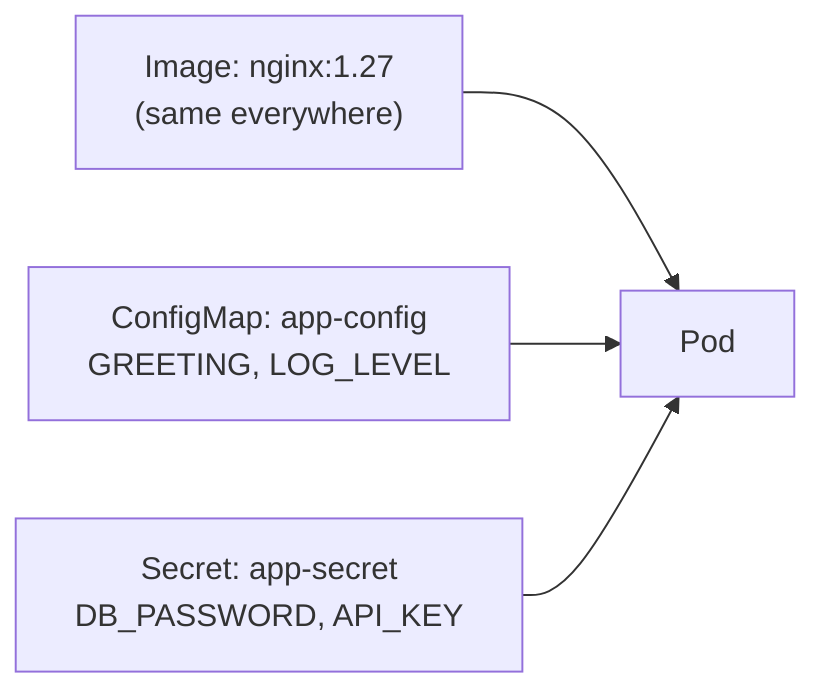

# 05: ConfigMap and Secret

> **Status:** completed · **Builds on:** [01-first-deployment](../01-first-deployment/)

## Objective

Move configuration and a fake credential out of the Deployment and into their own objects, inject them into a Pod as environment variables, and see exactly how "secret" a Kubernetes Secret really is.

By the end of this exercise you should be able to explain:

1. Why configuration and credentials are kept out of the image and out of the Deployment spec.
2. How `envFrom` injects every key of a ConfigMap or Secret as an environment variable.
3. That a Secret is base64-**encoded**, not encrypted — and what that means in practice.

## Concepts

### Why separate configuration from the image



The same image can run in dev, staging, and production. Only the ConfigMap and Secret change between environments — nothing is rebuilt.

### Base64 is not encryption

| | Base64 | Encryption |
|---|---|---|
| Purpose | Format conversion | Hiding data |
| Needs a key? | No | Yes |
| Reversible by anyone? | Yes, trivially | Only with the key |
| Protects against an attacker? | No | Yes |

A Kubernetes `Secret` stores its values base64-encoded. Anyone with access to the Secret object (or to `etcd`, the cluster's internal datastore) can decode it in one command. Base64 prevents *accidental* exposure in logs or terminals, not a determined attacker. Real protection needs encryption at rest or a tool like Sealed Secrets or Vault — out of scope here, but worth knowing by name.

## Reading the manifests

**`configmap.yaml`**

```yaml
apiVersion: v1
kind: ConfigMap
metadata:
  name: app-config
data:                          # plain key-value pairs, stored as-is
  GREETING: "Hello from a ConfigMap"
  LOG_LEVEL: "debug"
```

**`secret.yaml`**

```yaml
apiVersion: v1
kind: Secret
metadata:
  name: app-secret
type: Opaque                   # generic secret type (no special structure)
stringData:                    # write plain text here; Kubernetes base64-encodes it on save
  DB_PASSWORD: "demo-password-not-real"
  API_KEY: "demo-api-key-12345"
```

`stringData` is a convenience: you write plain text, Kubernetes stores it base64-encoded. The alternative field, `data`, requires you to encode the values yourself before writing the YAML.

**`deployment.yaml`**

```yaml
          envFrom:
            - configMapRef:
                name: app-config   # every key becomes an env var: GREETING, LOG_LEVEL
            - secretRef:
                name: app-secret   # every key becomes an env var: DB_PASSWORD, API_KEY
```

`envFrom` imports *every* key from the referenced object as an environment variable, named exactly as the key. (The alternative, `env` with `valueFrom`, imports one named key at a time — more precise, more typing.)

## Files

| File | Purpose |
|---|---|
| [`configmap.yaml`](configmap.yaml) | Non-sensitive config: `GREETING`, `LOG_LEVEL` |
| [`secret.yaml`](secret.yaml) | Fake credentials: `DB_PASSWORD`, `API_KEY` (demo values only, not real) |
| [`deployment.yaml`](deployment.yaml) | Single-Pod Deployment injecting both as environment variables |

## Steps

```bash
cd /Users/kuroko/Desktop/Nikan/k8s-practice/05-configmap-and-secret

# 1. Create the ConfigMap and Secret first (the Deployment references them by name)
kubectl apply -f configmap.yaml
kubectl apply -f secret.yaml

# 2. See how the Secret is actually stored — base64, not plaintext
kubectl get secret app-secret -o yaml

# 3. Decode one value by hand, to prove it's not encrypted
kubectl get secret app-secret -o jsonpath='{.data.DB_PASSWORD}' | base64 -d
echo   # just for a clean newline after the decoded output

# 4. Create the Deployment
kubectl apply -f deployment.yaml
kubectl get pods -l app=config-demo

# 5. Look inside the running Pod and read the environment variables
kubectl exec deploy/config-demo -- printenv | grep -E 'GREETING|LOG_LEVEL|DB_PASSWORD|API_KEY'
```

## Expected result

- Step 2: the YAML shows `DB_PASSWORD` and `API_KEY` as long base64 strings, not plain text.
- Step 3: decoding by hand returns `demo-password-not-real`, with no key or password needed — just the `base64 -d` command.
- Step 5: inside the container, all four variables appear as plain text — `GREETING=Hello from a ConfigMap`, `DB_PASSWORD=demo-password-not-real`, etc. Kubernetes decodes Secrets automatically when injecting them as environment variables.

## Results

**Step 2: the Secret as stored**

```yaml
apiVersion: v1
data:
  API_KEY: ZGVtby1hcGkta2V5LTEyMzQ1
  DB_PASSWORD: ZGVtby1wYXNzd29yZC1ub3QtcmVhbA==
kind: Secret
metadata:
  annotations:
    kubectl.kubernetes.io/last-applied-configuration: |
      {"apiVersion":"v1","kind":"Secret","metadata":{"annotations":{},"name":"app-secret","namespace":"default"},"stringData":{"API_KEY":"demo-api-key-12345","DB_PASSWORD":"demo-password-not-real"},"type":"Opaque"}
  ...
type: Opaque
```

**Step 3: manual decode**

```bash
kubectl get secret app-secret -o jsonpath='{.data.DB_PASSWORD}' | base64 -d
```

Returned `demo-password-not-real` — no key, password, or special tool required, just the standard `base64` command.

**Step 5: environment variables inside the running Pod**

```bash
kubectl exec deploy/config-demo -- printenv | grep -E 'GREETING|LOG_LEVEL|DB_PASSWORD|API_KEY'
```

```
API_KEY=demo-api-key-12345
DB_PASSWORD=demo-password-not-real
LOG_LEVEL=debug
GREETING=Hello from a ConfigMap
```

## Observations

1. **`kubectl get secret -o yaml` never shows plaintext in the `data` field** — only the base64 form. Decoding it took one piped command, no credentials of any kind.
2. **The `last-applied-configuration` annotation held a second, more readable copy.** Because `secret.yaml` used `stringData`, the exact JSON that was `apply`'d — including the plaintext values — got stored verbatim in that annotation. This means a Secret object can carry more exposed plaintext than the `data` field alone suggests. In a real cluster, anyone who can read this one object can read both the annotation and the base64 (which decodes trivially). RBAC on `get`/`list` for Secrets is the actual control, not the encoding.
3. **`envFrom` pulled every key automatically.** Nothing in `deployment.yaml` named `GREETING`, `LOG_LEVEL`, `DB_PASSWORD`, or `API_KEY` individually — adding a new key to the ConfigMap or Secret and restarting the Pod would expose it the same way, with no Deployment edit needed.
4. **Kubernetes decodes Secret values automatically when injecting them as environment variables.** The base64 encoding only exists at rest (in the object itself / in `etcd`); inside the container, the application sees plain text, exactly as if it had been passed a plain environment variable.
5. **This confirms the core lesson from the concept section**, now with real output: base64 stops a Secret from showing up as readable text by accident in a terminal dump, but it does not stop anyone with read access to the object from getting the plaintext in seconds.

## Clean up

```bash
kubectl delete -f deployment.yaml
kubectl delete -f secret.yaml
kubectl delete -f configmap.yaml
```

## Real Secrets never go in Git

Access control and source control are two separate protections, and both matter:

- **Inside the cluster**, who can read a Secret is controlled by **RBAC** (Role-Based Access Control) — a role either grants `get`/`list` on secrets or it doesn't. Base64 does not add protection here; it only stops the value from being readable *by accident* (e.g. in a terminal dump or a log line).
- **Outside the cluster**, a Secret manifest with real values must never be committed, for the same reason a `.env` file with real credentials never is. `secret.yaml` in this exercise is safe to publish because every value in it is a fake demo string, not a real credential.

In a real project, the usual patterns are:

- Add the real manifest to `.gitignore` (e.g. `secret.yaml`, or a `*.secret.yaml` pattern), and commit a `secret.example.yaml` with placeholder values instead, so the shape of the file is still documented.
- Or, more commonly in production, don't hand-write Secret YAML with real values at all — generate it from a secrets manager (Vault, AWS Secrets Manager, Sealed Secrets) as part of deployment, so the real value is never saved to disk as plain YAML in the first place.

## Interview phrasing

> "ConfigMaps and Secrets let you keep the same image across environments — only the configuration changes. But a Secret is only base64-encoded, not encrypted, so it's not a substitute for real secrets management like encryption at rest or a tool like Vault."

## Next

**Exercise 06: resource limits and requests.** Cap how much CPU and memory a single Pod can consume, so one misbehaving container cannot starve the whole Node.
