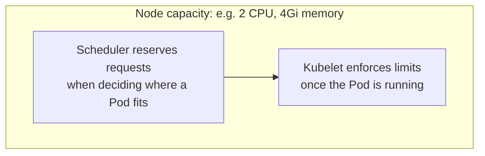

# 06: Resource Limits and Requests

> **Status:** completed · **Builds on:** [01-first-deployment](../01-first-deployment/)

## Objective

Give a Pod explicit CPU and memory boundaries, then deliberately exceed the memory limit and watch Kubernetes kill the container for it.

By the end of this exercise you should be able to explain:

1. The difference between a **request** (guaranteed minimum) and a **limit** (hard ceiling).
2. Why exceeding a CPU limit and exceeding a memory limit lead to different outcomes.
3. What `OOMKilled` means and how to recognize it.

## Concepts

### Requests vs. limits



| | Request | Limit |
|---|---|---|
| Used for | Scheduling decision — "does this Node have enough free capacity?" | Runtime enforcement — "stop this container from going further" |
| If omitted | Treated as 0 — the Pod can be scheduled anywhere, with no guarantee | No ceiling — a container can consume as much as the Node has |
| Unit (CPU) | `100m` = 0.1 core (1000m = 1 full core) | Same units |
| Unit (memory) | `64Mi` = 64 mebibytes (`Mi`, not `M` — binary, not decimal) | Same units |

### What happens when a limit is exceeded

- **CPU over limit → throttled.** The container is slowed down, not killed. CPU is a "soft" resource — you can take time-slices away without destroying anything.
- **Memory over limit → killed.** The container is terminated immediately with reason `OOMKilled` (Out Of Memory Killed), then restarted per the Pod's restart policy. Memory is "hard" — you cannot partially take away memory a process is already using.

## Files

| File | Purpose |
|---|---|
| [`deployment.yaml`](deployment.yaml) | `limited-nginx`: sane CPU/memory requests and limits, expected to run normally |
| [`oom-demo.yaml`](oom-demo.yaml) | A standalone Pod using `polinux/stress` (the standard image for this exact demo in the official Kubernetes docs) to deliberately request more memory than its limit allows |

## Reading the manifests

```yaml
resources:
  requests:
    cpu: "100m"      # guaranteed 0.1 of a CPU core
    memory: "64Mi"    # guaranteed 64 mebibytes
  limits:
    cpu: "250m"       # hard cap: 0.25 of a CPU core — throttled above this
    memory: "128Mi"   # hard cap: 128 mebibytes — killed above this
```

```yaml
# oom-demo.yaml — intentionally mismatched
resources:
  requests:
    memory: "50Mi"
  limits:
    memory: "100Mi"
command: ["stress"]
args: ["--vm", "1", "--vm-bytes", "150M", "--vm-hang", "1"]
# asks for 150M while the limit is 100Mi — the gap is the point
```

## Steps

### Part A — sane limits, nothing unusual happens

```bash
cd /Users/kuroko/Desktop/Nikan/k8s-practice/06-resource-limits
kubectl apply -f deployment.yaml
kubectl get pods -l app=limited-nginx

# see the requests/limits Kubernetes recorded, and the Pod's QoS class
kubectl describe pod -l app=limited-nginx | grep -A6 "Requests:"
kubectl get pod -l app=limited-nginx -o jsonpath='{.items[0].status.qosClass}'
echo
```

### Part B — deliberately trigger an OOMKilled

```bash
kubectl apply -f oom-demo.yaml
kubectl get pod oom-demo --watch
```

Wait for `STATUS` to change (Ctrl+C once it does), then:

```bash
kubectl describe pod oom-demo | grep -A10 "Last State"
```

## Expected result

- Part A: `limited-nginx` runs normally — a plain nginx container does not come close to 128Mi at idle. QoS class should print `Burstable` (requests and limits differ).
- Part B: `STATUS` moves to `OOMKilled` (or `Error`/`CrashLoopBackOff` depending on timing), and `kubectl describe` shows `Last State: Terminated`, `Reason: OOMKilled`.

## Results

**Part A: `limited-nginx` requests**

```
Requests:
  cpu:        100m
  memory:     64Mi
```

```bash
kubectl get pod -l app=limited-nginx -o jsonpath='{.items[0].status.qosClass}'
```
```
Burstable
```

**Part B: `oom-demo`**

```
NAME       READY   STATUS              RESTARTS   AGE
oom-demo   0/1     ContainerCreating   0          0s
oom-demo   1/1     Running             0          2s
oom-demo   0/1     OOMKilled           0          3s
```

```
Status:           Failed
Containers:
  stress:
    Image:         polinux/stress
    State:          Terminated
      Reason:       OOMKilled
      Exit Code:    137
      Started:      Wed, 07 Oct 2026 18:28:20 -0400
      Finished:     Wed, 07 Oct 2026 18:28:20 -0400
    Limits:
      memory:  100Mi
    Requests:
      memory:     50Mi
QoS Class:                   Burstable
Events:
  Normal  Started    62s   kubelet  spec.containers{stress}: Container started
```

## Observations

1. **The whole lifecycle took about 2 seconds.** `stress` started, immediately tried to allocate 150M against a 100Mi limit, and was killed almost instantly — this is not a graceful shutdown, it's the kernel OOM killer acting on a cgroup limit.
2. **Exit Code 137 is the tell.** 137 = 128 + 9, where 9 is `SIGKILL`. Any time a container's exit code is 137, that's a strong signal to check for a memory limit violation before looking anywhere else.
3. **`Started` and `Finished` timestamps were identical** (`18:28:20`) in the one-second-resolution output — confirming this was a near-instant kill, not a slow leak.
4. **QoS class was `Burstable` even though only `memory` was set** (no `cpu` request/limit on this Pod at all). Burstable only requires *at least one* resource to have a request or limit that doesn't exactly match across the whole Pod — it doesn't require every resource type to be set.
5. **`restartPolicy: Never` was essential for inspection.** Without it, Kubernetes would have restarted the container immediately (likely into a `CrashLoopBackOff` once it failed repeatedly), making the single failed state harder to catch and describe cleanly.
6. **This is the real-world debugging signature to remember:** a Pod repeatedly going into `CrashLoopBackOff` with `Reason: OOMKilled` and `Exit Code: 137` in its history means "raise the memory limit or fix a leak," not "something is broken with the app logic."

## Clean up

```bash
kubectl delete -f deployment.yaml
kubectl delete -f oom-demo.yaml
```

## Interview phrasing

> "Requests are what the scheduler uses to decide if a Pod fits on a Node; limits are enforced at runtime. Going over a CPU limit throttles the container — it just gets slower. Going over a memory limit kills it outright, because unlike CPU time, memory already in use can't be partially reclaimed."

## Next

**Exercise 07: Namespaces.** Separate environments (dev/staging/prod) inside one cluster, and see how resource quotas and RBAC can apply per namespace.
