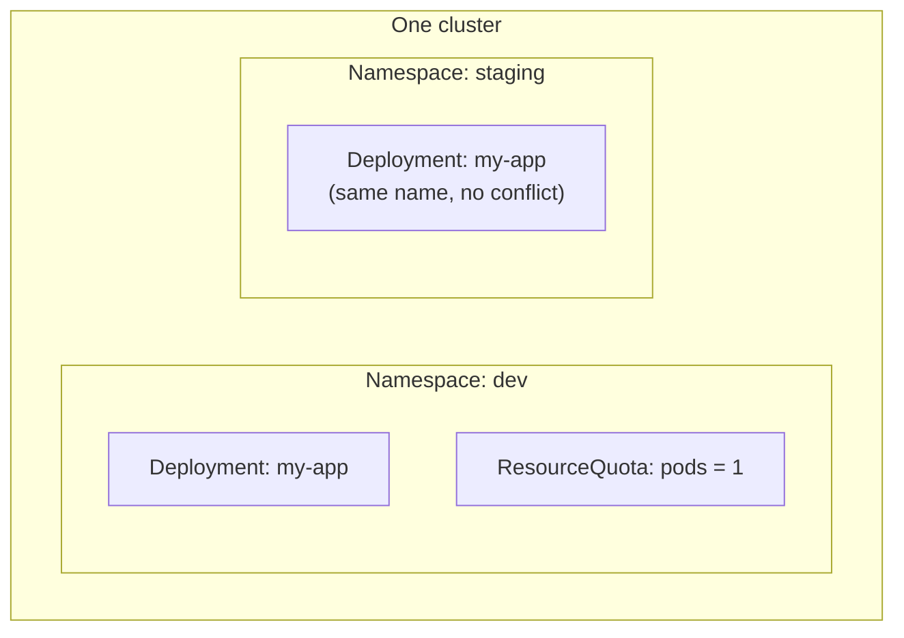

# 07: Namespaces

> **Status:** completed · **Builds on:** [01-first-deployment](../01-first-deployment/)
> **Last exercise in the current plan** — see the [root README](../README.md) for the full path from here.

## Objective

Split one cluster into separate virtual environments, deploy the same manifest into two of them without any name conflict, and cap how many Pods one environment is allowed to run.

By the end of this exercise you should be able to explain:

1. What a Namespace actually isolates (names, RBAC, quotas) and what it does not (Nodes are not namespaced).
2. Why `kubectl get pods` can look "empty" when you're not in the namespace you expect.
3. How a `ResourceQuota` enforces a hard cap per namespace, and what happens when it's hit.

## Concepts

### What a Namespace divides



Two Deployments can both be named `my-app` as long as they live in different namespaces. A name only has to be unique **within** a namespace.

### What stays shared, not namespaced

Nodes, PersistentVolumes, and the cluster itself are **cluster-scoped** — they exist outside any namespace, because they belong to the whole cluster, not one environment.

## Reading the manifests

**`namespaces.yaml`** — two `Namespace` objects, separated by `---` (a single file can define more than one object).

**`deployment.yaml`** — deliberately has no `namespace:` field. The namespace is supplied on the command line with `-n`, which is the normal way to reuse one manifest across environments.

**`resourcequota.yaml`**

```yaml
apiVersion: v1
kind: ResourceQuota
metadata:
  name: dev-quota
  namespace: dev     # this quota only applies inside "dev"
spec:
  hard:
    pods: "1"         # at most 1 Pod total in this namespace, from anything
```

## Files

| File | Purpose |
|---|---|
| [`namespaces.yaml`](namespaces.yaml) | Creates `dev` and `staging` |
| [`deployment.yaml`](deployment.yaml) | `my-app`, applied into each namespace separately via `-n` |
| [`resourcequota.yaml`](resourcequota.yaml) | Caps the `dev` namespace at 1 Pod |

## Steps

### Part A — isolation between namespaces

```bash
cd /Users/kuroko/Desktop/Nikan/k8s-practice/07-namespaces

# 1. Create both namespaces
kubectl apply -f namespaces.yaml
kubectl get namespaces

# 2. Deploy the SAME manifest into both, by name
kubectl apply -f deployment.yaml -n dev
kubectl apply -f deployment.yaml -n staging

# 3. Prove isolation: default namespace shows nothing
kubectl get pods
kubectl get pods -n dev
kubectl get pods -n staging

# 4. See everything, across all namespaces, in one shot
kubectl get pods -A
```

### Part B — a quota that blocks a scale-up

```bash
# 5. Apply the quota to "dev"
kubectl apply -f resourcequota.yaml
kubectl describe resourcequota dev-quota -n dev

# 6. Try to scale dev's Deployment past the quota
kubectl scale deployment my-app -n dev --replicas=2
kubectl get pods -n dev

# 7. See why the second Pod never showed up
kubectl describe deployment my-app -n dev | grep -A5 Conditions
```

## Expected result

- Step 3: `kubectl get pods` (no `-n`) returns nothing — it only looks in `default`, where nothing was deployed this time.
- Step 4: `kubectl get pods -A` shows both `my-app` Pods, one per namespace, with the `NAMESPACE` column distinguishing them.
- Step 6: `kubectl scale` itself succeeds (it just changes the Deployment's desired count), but `kubectl get pods -n dev` keeps showing only 1 Pod — the second one is refused by the quota.
- Step 7: the Deployment's conditions mention the second replica being blocked, with a quota-related reason.

## Results

**Step 2-3: isolation**

```
NAME                    READY   STATUS    RESTARTS   AGE
my-app-cd4c48cc-jqzzh   1/1     Running   0          49s     (dev)

NAME                    READY   STATUS    RESTARTS   AGE
my-app-cd4c48cc-gsppr   1/1     Running   0          50s     (staging)
```

Both Deployments are named `my-app`, both ran, no conflict. `kubectl get pods` with no `-n` showed only leftover Pods from earlier exercises still sitting in `default` (`config-demo`, `limited-nginx`, `oom-demo`) — a reminder that `default` is a real namespace with its own contents, not a neutral "everything" view.

**Step 5: the quota**

```
Name:       dev-quota
Namespace:  dev
Resource    Used  Hard
--------    ----  ----
pods        1     1
```

**Step 6: scale blocked**

```bash
kubectl scale deployment my-app -n dev --replicas=2
```
```
NAME                    READY   STATUS    RESTARTS   AGE
my-app-cd4c48cc-jqzzh   1/1     Running   0          85s
```

Only 1 Pod, even though the Deployment now wants 2.

**Step 7: the reason**

```
Conditions:
  Type             Status  Reason
  ----             ------  ------
  Progressing      True    NewReplicaSetAvailable
  Available        False   MinimumReplicasUnavailable
  ReplicaFailure   True    FailedCreate
```

```
Warning   FailedCreate   replicaset/my-app-cd4c48cc   Error creating: pods "my-app-cd4c48cc-2wghh" is forbidden: exceeded quota: dev-quota, requested: pods=1, used: pods=1, limited: pods=1
Warning   FailedCreate   replicaset/my-app-cd4c48cc   Error creating: pods "my-app-cd4c48cc-kkw7z" is forbidden: exceeded quota: ...
Warning   FailedCreate   replicaset/my-app-cd4c48cc   (combined from similar events): Error creating: pods "my-app-cd4c48cc-vlkrp" is forbidden: exceeded quota: ...
```

## Observations

1. **Two Deployments with the identical name `my-app` ran side by side with zero conflict**, purely because they lived in different namespaces. This is the core guarantee a Namespace makes.
2. **`default` is not "no namespace" — it's a namespace with real contents.** Pods from Exercises 04-06 were still sitting there and showed up the moment a plain `kubectl get pods` was run with no `-n` flag.
3. **`kubectl scale` succeeded at the API level but was blocked at admission.** The Deployment's desired replica count really did become 2 — `Progressing: True` confirms the controller accepted the change. The quota stopped the second Pod from ever being *created*, which is a different layer than the Deployment itself.
4. **The ReplicaSet controller retried repeatedly**, generating a new candidate Pod name each attempt (`2wghh`, `kkw7z`, `tgd7m`, `vlkrp`), and Kubernetes eventually combined the repeated failures into one event ("combined from similar events") instead of spamming the event log forever.
5. **The error message is self-explanatory and exact**, down to the numbers: `requested: pods=1, used: pods=1, limited: pods=1`. In a real incident, this is the line to search logs/events for — no guessing required.
6. **`ResourceQuota` and the per-Pod `resources.limits` from Exercise 06 solve different problems.** A `ResourceQuota` caps totals for a whole namespace (how many Pods, how much combined CPU/memory); a Pod's own `resources.limits` caps that one container. Both are usually used together in a real cluster.

## Clean up

```bash
kubectl delete namespace dev
kubectl delete namespace staging
```

Deleting a namespace deletes everything inside it — there's no need to delete the Deployment or the quota separately first.

## Interview phrasing

> "A Namespace gives you a virtual sub-cluster: names only need to be unique within it, and you can attach RBAC and ResourceQuotas per namespace. It's how one physical cluster safely hosts dev, staging, and production side by side."

## This was the last exercise in the plan

The path from here, if you want to keep going past the core objects covered in 01–07: **Ingress** (routing HTTP traffic by hostname/path to different Services), **Helm** (packaging a set of manifests as one reusable, versioned chart), or **StatefulSet** (for workloads that need stable identity and storage, like a database) — all a step up in complexity from what junior/associate-level JDs in this market have asked for so far.
